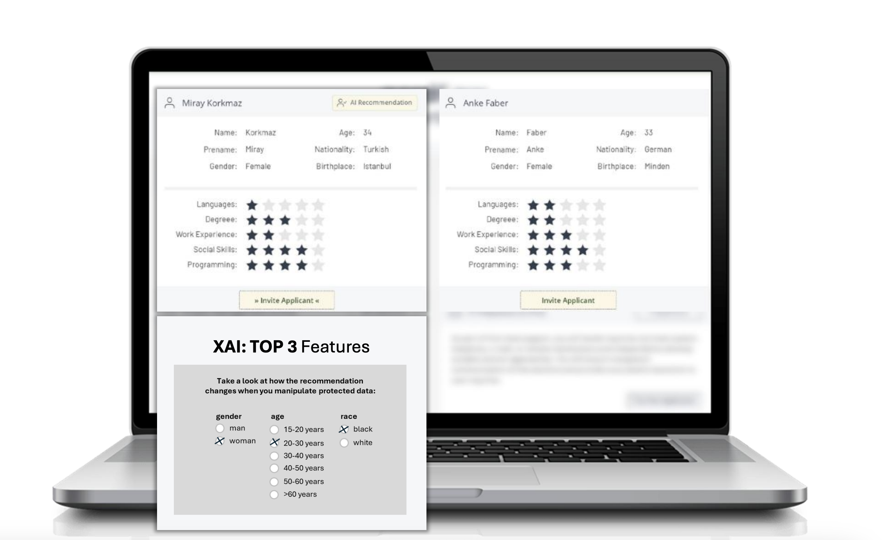
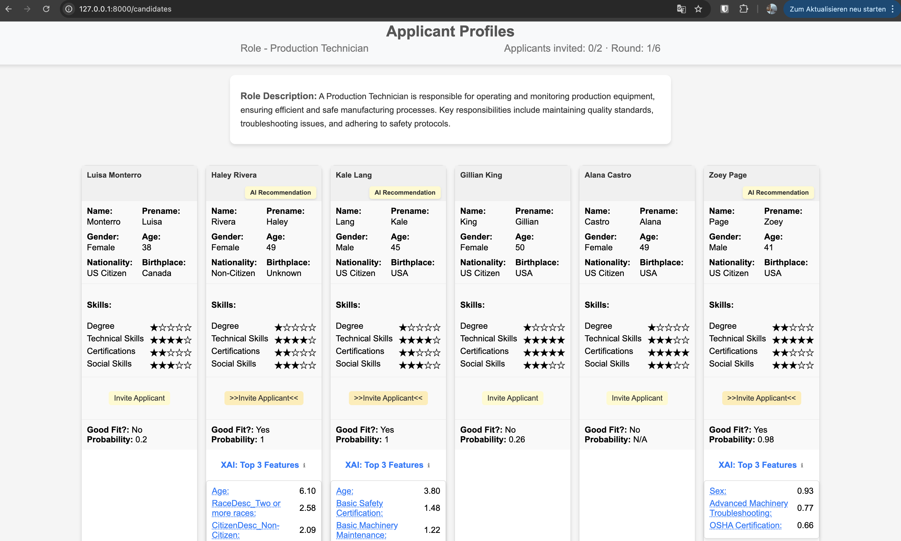
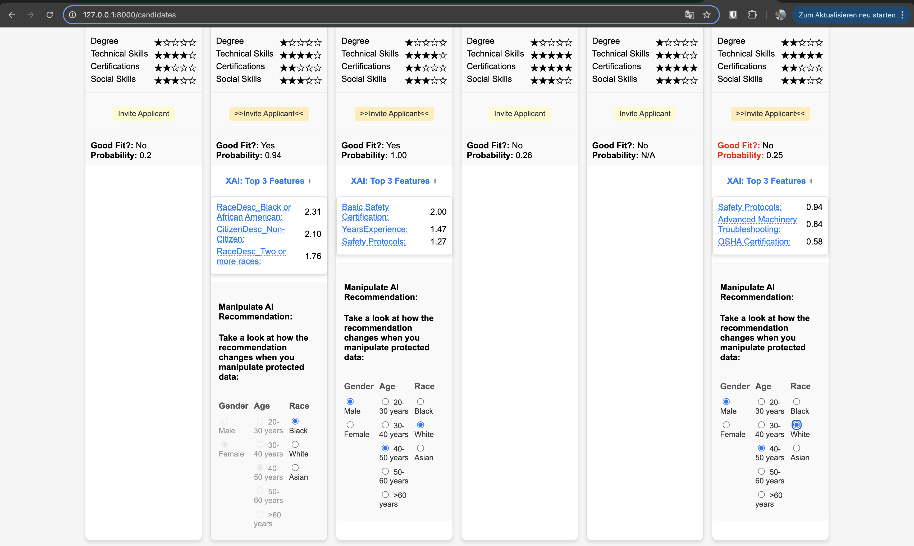

# Bias and Fairness Demonstrator: Predicting Role Fit  

This project explores bias and fairness in machine learning decision-making systems, focusing on predicting whether a candidate is a good fit for a specific role based on historical employee data. The goal is to analyze how AI recommendations influence human decision-making in candidate selection.  

---

## Objective  

- Train a classifier on **historically biased employee data** to reflect real-world biases. 
- Implement counterfactual analysis to evaluate how changes in individual features impact model decisions.
- Develop an interactive system to study user decision-making when selecting candidates based on AI recommendations.  
- Implement and compare different variations of AI-assisted selection to evaluate their impact:  
  1. **AI Recommendation Only:** Candidate cards display an AI-generated **good fit** badge based on the (biased) classifier.  
  2. **AI Recommendation + XAI:** Candidate cards include the **good fit** badge and an **explainability (XAI) section**, showing the most important features influencing the decision (SHAP values).  
  3. **AI Recommendation + XAI + Feature Manipulation:** Users can **manipulate candidate attributes**, triggering a **new AI prediction** to observe how changes affect the decision.  
- Demonstrate fairness interventions with user-friendly visualizations.
- Analyze and visualize how biased data influences decisions.

The candidate pool is preselected from the dataset to maintain consistency in evaluation.  

---

## Contributors  

This project is developed as part of a research collaboration between:  

- **Chiara Schwenke** – Research lead, concept & study design  
- **Markus Kühnle** – System development & implementation & study design 
- **Institute of Business Analytics, University of Ulm** – Research support & academic supervision  

This tool serves as a research artifact to study decision-making behavior in candidate selection.  

## Interactive Candidate Selection Interface Mockup



---

## **Project Setup**  

To set up the project, follow these steps:  

### **1. Clone the Repository**
Navigate to your desired local directory and clone the repository:  

```sh
cd /path/to/your/projects  
git clone https://github.com/markuskuehnle/bias-fairness-mvp.git  
cd bias-fairness-mvp  
```

### **2. Install `uv` (Optional, Recommended for Dependency Management)**  
[`uv`](https://github.com/astral-sh/uv) is a fast package manager that simplifies dependency handling. If you don’t have `uv` installed, you can install it with:

```sh
pip install uv
```

Then verify the installation:

```sh
uv --version
```

### **3. Create a Virtual Environment**  
It's recommended to use a virtual environment to isolate dependencies.  

Run the following command to create a `.venv` folder in the project directory:

```sh
python -m venv .venv  
```

Activate the virtual environment:  

- **macOS/Linux:**  
  ```sh
  source .venv/bin/activate  
  ```
- **Windows (PowerShell):**  
  ```sh
  .venv\Scripts\Activate  
  ```

### **4. Install Dependencies**  

#### **Using `uv` (Recommended)**
If you have `uv` installed, install dependencies from `uv.lock`:

```sh
uv venv .venv  
uv pip sync  
```

Alternatively, if you need to install from `requirements.txt`:

```sh
uv add -r requirements.txt  
```

#### **Using `pip` (Alternative)**
If you prefer `pip`, install dependencies from `requirements.txt`:

```sh
pip install -r requirements.txt  
```

### **5. Verify Installation**  

Check if the virtual environment is active and dependencies are installed correctly:

```sh
python -m pip list  
```

If using `uv`, you can also verify dependencies with:

```sh
uv pip list  
```

You're now ready to run the notebooks and start the project. 🖥️

---

## Dataset Information

### HR Data Set
This project utilizes the **HR Data Set Based on Human Resources Data Set**:
- Source: [Kaggle Dataset](https://www.kaggle.com/datasets/davidepolizzi/hr-data-set-based-on-human-resources-data-set).
- Additional datasets for selection can be found under: [Bias-Fairness-Data Repository](https://github.com/markuskuehnle/bias-fairness-data?tab=readme-ov-file).

---

## Dataset Preparation

### Define the Target Variable
- **"Fit for the Role"**:
  - Use `PositionID` or `Department` as the target role identifier.
  - Define "fit" based on:
    - **Performance**: Use `PerformanceScore`, `Rating`, or `EngagementSurvey` as indicators of success in similar roles.
    - **Experience**: Use tenure (`DateofHire` to `DateofTermination` or current date for active employees).
    - **Job Alignment**: Match attributes like skills (`PayRate`, `Position`) to job requirements.

### Label Candidates
- Create a binary label (e.g., `Good Fit` or `Not a Good Fit`) for a specific role based on:
  - Performance in the same or similar roles.
  - Tenure above a certain threshold (e.g., >1 year in the same position).
  - Department or role alignment.
  - Attributes like `PayRate` aligning with the average for that position.

### Feature Selection
- Include:
  - **Demographics**: (`GenderID`, `RaceDesc` for bias analysis).
  - **Professional attributes**: (`DeptID`, `PositionID`, `PayRate`, `SpecialProjectsCount`).
  - **Performance metrics**: (`PerformanceScore`, `EngagementSurvey`, `DaysLateLast30`).
  - **Tenure and experience metrics**.
- Exclude attributes that won’t impact role fit (e.g., `Zip`, unless geography matters).

### Encode Categorical Features
- Encode features like `Position`, `Department`, `RecruitmentSource`, and `ManagerName`.

### Normalize Continuous Features
- Normalize attributes like `PayRate`, `EngagementSurvey`, and `Age` for consistent scaling.

### Handle Missing Data
- Impute missing values (e.g., `PayRate`, `DOB`) with domain-appropriate methods.

---

## Notebooks  

- **01_data_exploration**: Performs an initial analysis of the dataset, identifying key patterns, distributions, and potential data quality issues.  
- **02_data_cleaning**: Prepares the raw HR dataset by handling missing values, correcting inconsistencies, and engineering new features. This step ensures a clean, standardized dataset suitable for fairness and bias analysis.
- **03_simulate_additional_information**: Enhances the dataset by simulating skills, certifications, and education levels based on role-specific requirements. This improves realism and helps evaluate biases in AI-based CV screening.
- **04_encode_data**: Transforms categorical features into a machine-readable format using encoding techniques like one-hot encoding and label encoding. It also normalizes numerical features and prepares the dataset for modeling.
- **05_train_test_split**: Splits the processed dataset into training and testing sets while ensuring stratification of the target variable. This ensures balanced class distributions for model evaluation.
- **06_train_baseline_model**: Trains a simple baseline model as a reference for performance comparison.  
- **07_train_xgb_model**: Trains an XGBoost model, tuning hyperparameters for improved predictive accuracy.  
- **08_show_metrics**: Extracts and displays model evaluation metrics from the experiment tracker. It retrieves parameters from a specific experiment and provides insights into performance comparisons.
- **09_train_nn**: Trains a neural network for the prediction task, leveraging deep learning techniques.  
- **10_bias_demonstration**: Analyzes potential bias in model predictions using statistical tests, confusion matrices, calibration checks, and SHAP explainability. It examines demographic disparities and evaluates fairness across different subgroups.
- **11_counterfactual_calculation**: Computes counterfactual predictions by modifying specific attributes (e.g., race, gender, years of experience) to assess their impact on model outcomes. The notebook highlights potential biases and evaluates the model’s sensitivity to individual features.
- **12_create_static_data_for_mvp**: Generates a static dataset for the app MVP by selecting relevant candidate data from processed datasets. It includes feature enrichment, birthplace estimation, technical skills, and certification scoring before saving the final dataset as a Parquet file.
- **13_create_feature_description_json**: Creates a JSON file that documents feature descriptions, aligning them with role-specific skills and certifications. The notebook ensures consistency between feature names and role attributes while validating completeness.
- **14_review_predictions**: Applies a pre-trained XGBoost model to predict candidate suitability and visualizes the prediction distribution. It also explores SHAP-based feature importance, balances the dataset via downsampling, and prepares the data for further analysis.
- **15_run_pipeline**: Executes the full data pipeline, integrating all preprocessing, model training, and evaluation steps.  

---

## Step-by-Step Plan to Build the MVP

### Phase 1: Initial Development in Notebooks

✅ 1. **Define Scope**
   - Identify key functionalities: predicting role fit, analyzing bias, visualizing fairness metrics, and exploring counterfactuals.

✅ 2. **Data Exploration**
   - Understand and clean the dataset.
   - Analyze distributions of sensitive features (e.g., gender, age, race).
   - Engineer features like age, tenure, and department alignment.

✅ 3. **Enhance Dataset with Simulated Data**
   - Augment the dataset with simulated information for skills, certifications, and education levels tailored to each role.
   - Introduce a scoring system to calculate fit points based on qualifications, ensuring alignment with real-world expectations for each role.
   - Adjust qualifications dynamically for employees with higher performance scores to reflect logical consistency.
   - Validate the updates by correlating features and ensuring thresholds for role fit are met realistically.

✅ 4. **Encode and Prepare Data**
   - Transform categorical features using one-hot encoding, label encoding, and multi-label binarization.  
   - Encode multi-label columns (e.g., skills, certifications) and combined them with the main dataset.  
   - Save the processed dataset and encoding models for consistency in downstream tasks.  

✅ 5. **Train Biased Models**
   - Use historical data containing biases to train a baseline model.
   - Train a biased classifier (e.g., logistic regression, decision tree).
   - Visualize biased decisions using SHAP or LIME.

✅ 6. **Demonstrate Bias**
   - Implement bias metrics in the notebook.
   - Show which features contributed most to biased decisions.

✅ 7. **Counterfactual Analysis**
   - Develop a module to simulate "what-if" scenarios:
     - Example: "What if the candidate’s gender were different?"
     - Measure changes in prediction probability and decision outcomes.

### **Phase 2: Backend Development**

✅ 8. **Build Core API Endpoints (Priority Task)**  
   - Use **Flask** or **FastAPI** to implement the following endpoints:  
     - **GET /candidates**: Retrieve a list of 3 static candidates with their attributes and predictions.  
     - **POST /modify**: Accept changes to a candidate’s attributes (e.g., gender, age, race) and return updated predictions and counterfactual results.  
     - **GET /fairness** (Optional): Provide fairness and bias insights if needed later.

✅ 9. **Static Data Integration**  
   - Pre-load the data for 3 candidates into a static CSV or JSON file for simplicity.  
   - Use a utility script (`static_data_loader.py`) to serve this data via the API.

✅ 10. **Use Pre-Trained Model**  
   - Integrate the pre-trained **XGBoost** model to serve predictions via the API.  
   - Implement logic for simulating counterfactuals in the backend using **`counterfactuals.py`**.

### **Phase 3: Frontend Development**

✅ 11. **Build a Simple Interactive Frontend**  
   - Use **HTML/CSS** for rapid frontend prototyping:
     - Display the list of 3 candidates with their current attributes and predictions.  
     - Show Predictions and SHAP values 

### **Phase 4: Add Additional Backend Routes**

✅ 12. **Extend API Functionality**  
   - Add the following routes to enhance interactivity:  
     - **POST /select_candidate**:  
       - Accept a candidate's ID as input and mark the candidate as selected.  
       - Return a confirmation response with the selected candidate's details.  
     - **GET /selected_candidate**:  
       - Retrieve the details of the currently selected candidate, including attributes and predictions.  
   - **Next Steps: Build the XAI Selection Tool**:  
     - Allow users to temporarily modify one attribute at a time (e.g., age, sex, gender) and review the new prediction in the frontend.  
     - Ensure invited candidates are dropped from the selection pool after being selected.  
     - Present a new set of candidates for the next round of invitations, up to **6 rounds** in total.  
     - Add a **"Next Round" button** in the frontend, prompting confirmation before proceeding.  
     - Remove all candidates from the previous round permanently when moving to the next round.  

13. **Update Static Data Handling**  
   - Ensure the `static_data_loader.py` script supports tracking the selection state for candidates.  
   - Add logic to update and serve the selected candidate dynamically.

14. **Save Candidate Selection and Flags**
   - Ensure the data about invited candidates is saved. (Consider saving the alternative candidates per round - round and user-id required)

15. **Add Configurations**  
   - Use a configuration file (`config.yaml`) to manage:
     - Data paths (e.g., CSV/JSON for candidates).
     - Sensitive attributes (e.g., gender, race, age).
     - Thresholds for predictions.

### **Phase 5: Deployment**

16. **Containerize the Application**  
   - Use **Docker** to containerize the backend and frontend for consistency.  

17. **Deploy the MVP**  
   - Host the MVP on **Heroku**, **Render**, or **AWS** for user testing and feedback.  

---

## Tool Screenshots: Candidate Selection & Bias Analysis Overview





---

## Simple Tech Stack
- **Data Processing & Modeling**: Python, Pandas, Scikit-learn.
- **Backend**: Flask/FastAPI.
- **Frontend**: HTML/CSS, React.js (optional advanced).
- **Visualization**: Matplotlib, Plotly, SHAP.
- **Deployment**: Docker, Heroku/Render.

---

## Future Improvements
- Integrate more advanced fairness-aware algorithms.

---

### Topics for Discussion

1. **Frontend Display:**
   - Should the binary label (`GoodFit`) and its associated probability be displayed to the user in the frontend?  
   - Should the `XAI: Top 3 Features` be shown only for recommended candidates?

2. **Feature Visibility:**
   - Should features like `Sex`, `YearsExperience`, or `RaceDesc_*` be included in the `Top 3 Features` displayed to the user?

3. **Candidate Pool Management:**
   - Should only the invited applicants be dropped from the system after each round, or should all applicants (both invited and not invited) be dropped?
   - How many applicants should be included in the dataset?  
   - How many candidates should be suggested in the frontend for the user to review?
   - What is the maximum number of candidates that can be invited?
   - How many selection rounds should a user complete?
   - Should the candidate rounds be reproducible? (random selection)
   - Preselection of candidates to ensure imbalance in recommendations

---

### Additional Notes and Considerations

**Done:**

- Included `Age` in the Frontend and Data
- The information about `Birthplace` was simulated using `RaceDesc_*` and `Nationality` in the Notebook 12
- If technical skills appear among the most important features of the AI recommendations, a short explanation of these skills should also be displayed.  
- A role description should be included to provide context.
- Applicants shown to the user should belong to the same role (e.g., Production Technician) to ensure consistent star ratings for skills across candidates. (Pre-selected)
- Preselection of candidates to ensure imbalance in recommendations

**Todo:**

- `Race` could be missing, since we dont map Latino/Hispanic/etc.
